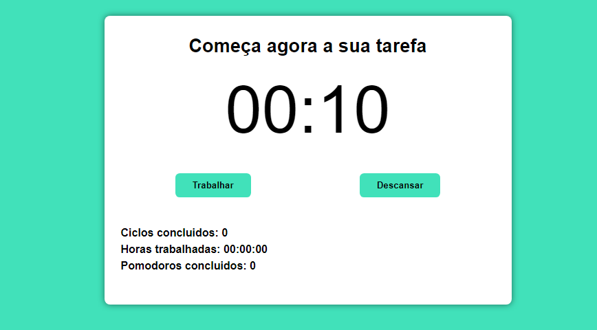

# TypeScript Pomodoro React

Este `Projeto` foi desenvolvido para fins de exercicíos com o objetivo de melhorar as minhas `habilidades` em `TypeScript` com `React`. Basicamente este `projeto` é um simples `Pomodoro` como é sabido o conceito do Pomodoro é que a pessoa que vai estudar ou executar uma tarefa demore, exatamente, 25 minutos. Concluindo-a ou não, ele deve parar e descansar 5 minutos. E depois de totalizar 4 ciclos ele deve descansar 15 minutos.

## Tecnologias

As seguintes ferramentas foram usadas na constuição deste projeto:

- HTML
- CSS
- TYPESCRIPT
- REACT

#

Feito por ❤ Pascoal Kahamba meu [Linkedin](https://www.linkedin.com/in/pascoal-kahamba-7b43bb233?lipi=urn%3Ali%3Apage%3Ad_flagship3_profile_view_base_contact_details%3BTg8LEKayToyytOX1pVAQ%2Bg%3D%3D)
